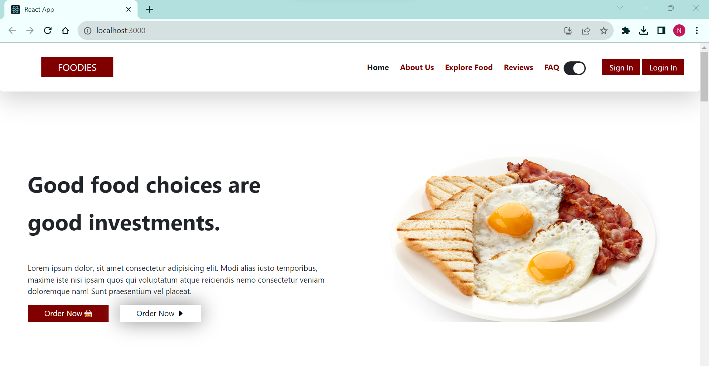
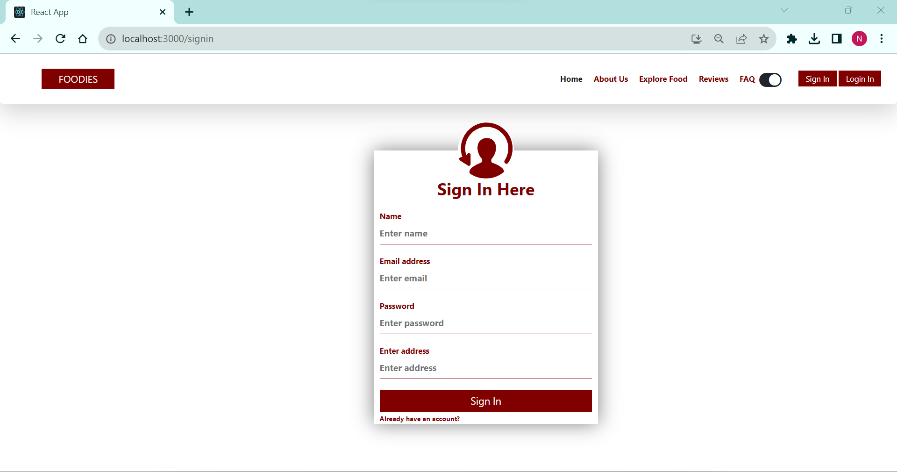
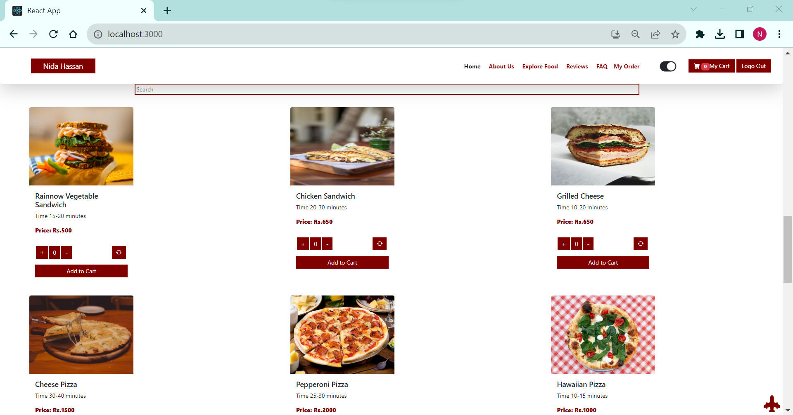
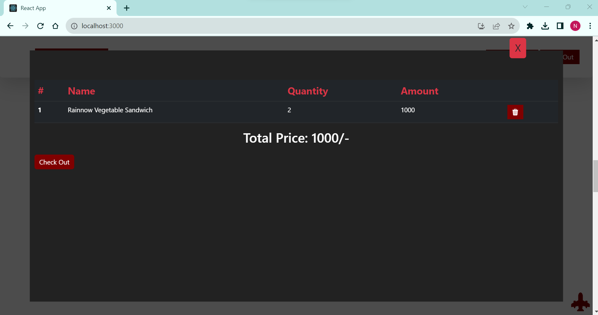
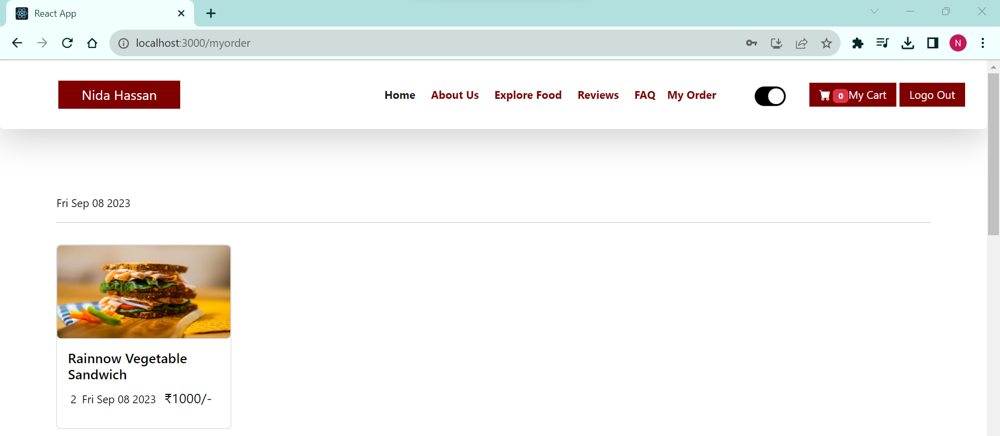

## MERN Food Ordering
MERN stack project for Food ordering system that allow customers to browse the menu, place food orders, and view their order history. Enhanced user experience with a Dark Mode feature, providing users to switch between light and dark modes.

## Overview

- **Frontend**: Developed with React.js
- **Responsiveness**: Fully responsive design
- **Backend**: Node.js and Express
- **Database**: MongoDB

## Prerequisites

- **Node.js**: Node.js should be installed on your system as it's required to run the project.
- **MongoDB**: MongoDB should be set up and running since it serves as the database for your application.
- **Dependencies**: Please review the project's `package.json` file to see the list of Node.js modules and libraries used in this project.

## Technologies Used
- React JS
- Express JS
- Node JS
- Mongodb
- Context Api

## How to Run

In terminal run "npm i" command and run same command in backend folder

## Screenshots

    <b>Home Page</b>

    <b>Sign In Page</b>

    <b>Add To Cart Page</b>

    <b>Checkout Page</b>

    <b>History Page</b>

